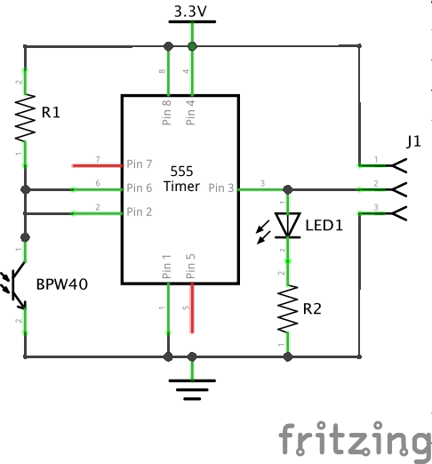
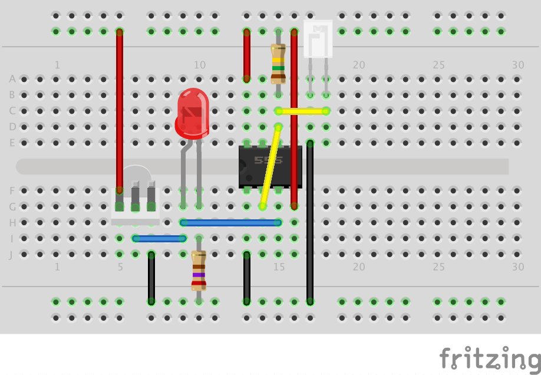

# EnergMmeter
Energy meter for the Raspberry Pi

## Schema
You can use the following schema and connect it to the Raspberry Pi (derived from Diederich Kroeske's schema). Make
sure you use the 3.3V VDC line of your Raspberry Pi. Using 5V will damage your GPIO inputs. This schema can be used
for an Arduino board as well and then you do need to use the 5V VDC. Make sure you change R2 accordingly to compensate
for the higher voltage.

The LED is and R2 are only useful for debugging. Whenever a pulse is detected, then the LED flashes as well. If you
don't need this functionality, then you can omit these parts.

Resistor capacities:

* R1: 10kOhm - 150kOhm (use higher resistance for higher sensitivity)
* R2: 270Ohm (use lower for brighter LED)

You can also replace R1 with a resistor and add a variable resistor, so the sensitivity is adjustable. Make sure you
keep the R1 resistor (at 10kOhm) to prevent a short-circuit when the variable resistor is set at a low resistance.

## Breadboard
It's best to try the hardware on a breadboard to make sure everything works with your setup. Depending on your
installation you might need to fiddle a bit with the resistors to get the appropriate resistor. When you put
everything on your breadboard, then it should look like this:

