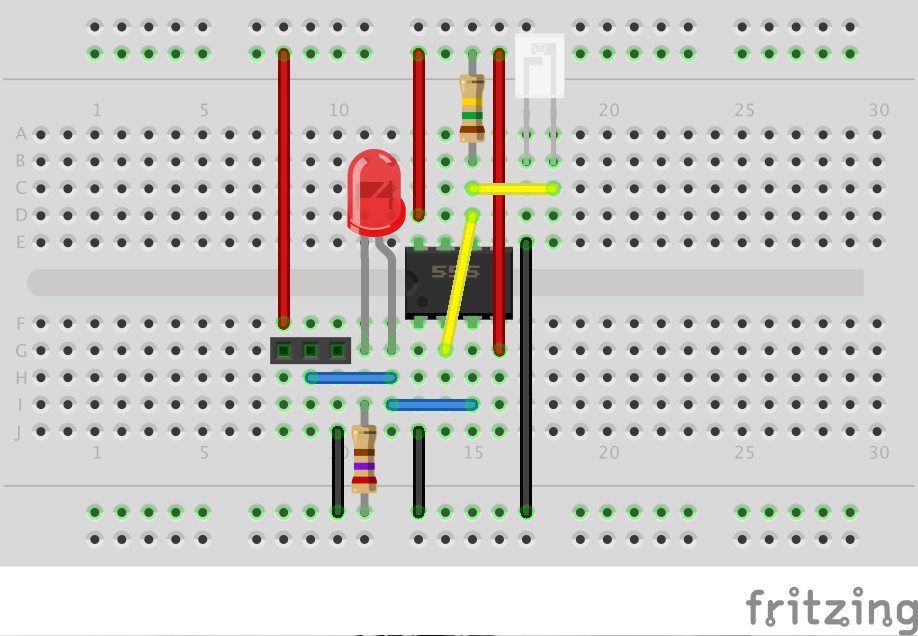

# EnergyMeter
Energy meter for the Raspberry Pi.

## Hardware
The Raspberry Pi is powerful device, but we do need some additional components to be able to monitor the LED pulses
and/or magnetic pulses. The used components are inexpensive and generally available. I bought al my components at
[Bits & Parts](http://www.bitsandparts.eu) (Netherlands).

### Schema
You can use the following schema and connect it to the Raspberry Pi (derived from 
[Diederich Kroeske's schema](http://gathering.tweakers.net/forum/list_message/43482152#43482152)). Make sure you use
the 3.3V VDC line of your Raspberry Pi. Using 5V on your GPIO input lines will damage your Raspberry Pi. This schema
can be used for an Arduino board as well and then you do need to use the 5V VDC. Make sure you change R2 accordingly
to compensate for the higher voltage (otherwise 

The LED is and R2 are only useful for debugging. Whenever a pulse is detected, then the LED flashes as well. If you
don't need this functionality, then you can omit these parts.

Resistor capacities:

* R1: 10kOhm - 150kOhm (use higher resistance for higher sensitivity)
* R2: 270Ohm (use lower for brighter LED)

You can also replace R1 with a resistor and add a variable resistor, so the sensitivity is adjustable. Make sure you
keep the R1 resistor (at 10kOhm) to prevent a short-circuit when the variable resistor is set at a low resistance.

You'll find other schematics that accomplish the same task and might look less complex. The 555 is used in a
[Schmitt trigger configuration](http://en.wikipedia.org/wiki/Schmitt_trigger) to convert the analog signal of the
photo transistor into a digital signal. A Schmitt trigger has a built-in hysteresis preventing excessive pulses during
the high/low transitions.

If you use a reed switch to monitor a gas meter, then you can use a 10kOhm resistor. Make sure you test different
orientations for your reed sensor, because the polarity matters. When you want to monitor two or more meters
(i.e. energy and gas), then you can duplicate this schema. You could use a single 556 instead of two 555s if you like.

### Breadboard
It's best to try the hardware on a breadboard to make sure everything works with your setup. Depending on your
installation you might need to fiddle a bit with the resistors to get the appropriate resistor. When you put
everything on your breadboard, then it should look like this:

When buying a breadboard, don't forget to buy a 3.3V power supply, some female/female wires (to connect the RPi to
the breadboard) and a dozen male/male wires in various colors. You will need them.